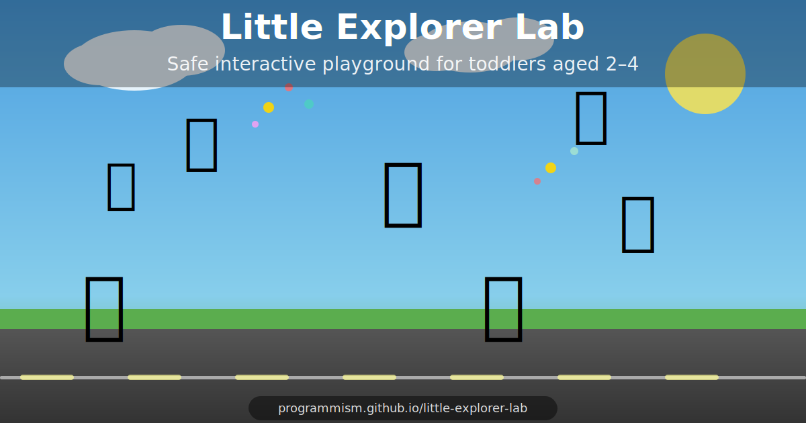

# 🧪 Little Explorer Lab

> **A safe, fullscreen interactive playground for curious toddlers aged 2–4.**

[](https://programmism.github.io/little-explorer-lab/)
[](https://github.com/programmism/little-explorer-lab/actions/workflows/deploy.yml)
[](LICENSE)

---



---

## What is it?

A toddler-safe fullscreen world where **every touch causes a friendly reaction**.
No goals. No scores. No text. Just cause and effect.

> "I touched something — and the world responded."

Works on phones, tablets, laptops. Fully offline. Zero ads. Zero links.

**[▶ Open the playground](https://programmism.github.io/little-explorer-lab/)**

---

## Features

| Feature | Description |
|---|---|
| 🚗 **Cars** | Drive across the road — tap to honk, flash, and zoom |
| ⚽ **Balls** | Physics-based bouncing — tap to smash in any direction |
| 🚀 **Rocket** | Floats peacefully — tap for a blazing launch with particle trail |
| ⭐ **Stars** | Drift through the sky — tap for a golden sparkle burst |
| 🦋 **Butterflies** | Wander freely — tap to scatter them away |
| 🎨 **Drawing** | Drag a finger or mouse to paint glowing rainbow trails that fade |
| ⌨️ **Keyboard** | Every key press shows a giant colorful floating letter with sound |
| 🌅 **Day/night cycle** | The world slowly cycles from dawn → noon → dusk → midnight |
| 🎆 **Emergent events** | Random confetti, rainbow bursts, new actors appear spontaneously |
| 🔇 **Synthesized audio** | All sounds generated via Web Audio API — no audio files needed |
| 🔒 **Input capture** | Keyboard shortcuts, context menus, and browser gestures disabled |
| 🚪 **Safe exit** | Hold top-right corner for 3 seconds to exit fullscreen |

---

## Design principles

- **Zero failure states** — nothing can be broken
- **No text in the experience** — purely visual
- **Touch-first** — large hit areas, no precision required
- **Calm visuals** — no flashes, no aggressive camera movement
- **Offline-capable** — no network required after first load
- **No ads, no links, no tracking**

---

## Getting started

```bash
git clone https://github.com/programmism/little-explorer-lab.git
cd little-explorer-lab
npm install
npm run dev
```

Then open `http://localhost:5173/little-explorer-lab/` in your browser.

### Build for production

```bash
npm run build
# output in dist/
```

---

## Architecture

```
src/
  main.js            # Entry point, fullscreen request
  GameLoop.js        # requestAnimationFrame loop with dt cap
  InputManager.js    # Mouse, touch, keyboard capture + exit gesture
  AudioManager.js    # Web Audio API synthesized sounds
  ParticleSystem.js  # Burst and trail particle effects
  DrawingLayer.js    # Freehand rainbow drawing with fade
  KeyLabel.js        # Floating letter animation on key press
  Background.js      # Animated day/night sky, clouds, stars, road
  World.js           # Scene manager, emergent events, input routing
  actors/
    Actor.js         # Base class
    Car.js           # Physics + color flash + honk
    Ball.js          # Gravity + squish + color change
    Rocket.js        # Launch trajectory + particle trail
    Star.js          # Float + sparkle burst
    Butterfly.js     # Wander AI + scatter on tap
```

---

## Tech stack

- **Vanilla JS** (ES modules) — no framework
- **HTML5 Canvas 2D** — all rendering
- **Web Audio API** — synthesized sounds
- **Vite** — dev server and build
- **GitHub Actions** — CI and deploy to GitHub Pages

---

## Contributing

New actors are easy to add — extend `Actor` and drop into `World._spawn()`.
Each actor needs: `update(dt, w, h, particles)`, `draw(ctx)`, `hitTest(x, y)`, `onTap(x, y, particles, audio)`.

PRs welcome!

---

## License

MIT © [programmism](https://github.com/programmism)
